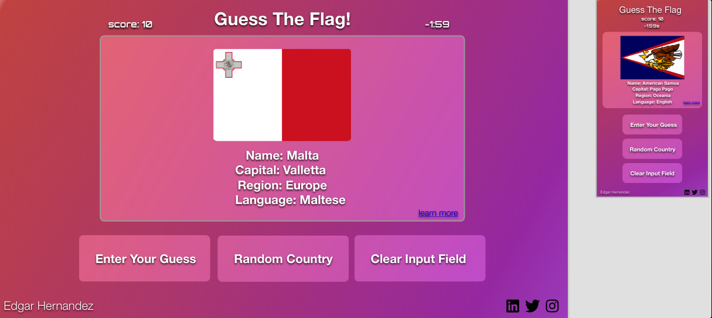
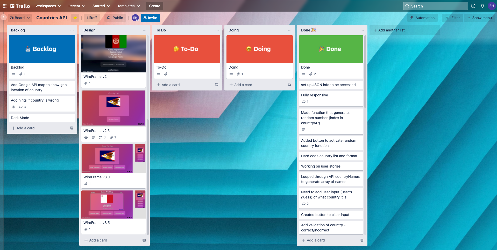

# Guess The FLag

[GIF of webapp in use](assets/guesstheflagGIF.mp4)

### Table of Contents

1. Project Demo Link
2. Objective
3. Motivation
4. Wireframe
5. Trello
6. How to Play
7. Technologies Used

### Project Demo Link: [Guess The Flag](https://eh-git-hub.github.io/countryAPI/)

### Objective:

An interactive and educational JavaScript game where the user races against the clock to guess as many flags and accumulate the most points.

### Motivation and Goal:

The goal was to build a personal project after completing the LaunchCode LC101 Web Development Bootcamp.

This involved: 

1. Pre-planning UI/UX and wire-framing using Adobe XD
2. Using Trello to keep project organized and on track
3. Creating user stories to help plan tasks and determine what went into the MVP and following iterations
4. Accessibility enhancements (Using images, colors, buttons, playability, HTML semanticsm etc)
5. Intentionally breaking up the code into smaller functions
6. Integrating user feedback

### Wireframe:

### Trello:

### How to Play:

- First the player has to press the random country to start the game
- The game will then reset the focus to the input box indicating where the gues should go 
- Then, based on the flag, capital, region, and language the player will input their guess
- After typing out their guess the player will hit the submit button
- If the player has guessed correctly, a "correct!" message will show up, the image will change, and your score will increase
- If the player enters a wrong guess, a "try again!" message will show up, your score will be decrease, and the image will remain the same 

### Technologies Used

**Git-Hub Pages**: A static site hosting service that takes HTML, CSS, and JavaScript files straight from a repository on GitHub

**Git-Hub:** A code hosting platform for version control and collaboration

**Abode XD** A vector-based experience design platform that gives teams the tools they need to craft UI/UX wireframes

**JavaScript:** Object-oriented programming language for web pages

**HTML:** Mark-up language for creating web pages

**CSS:** A formatting language for styling web pages
